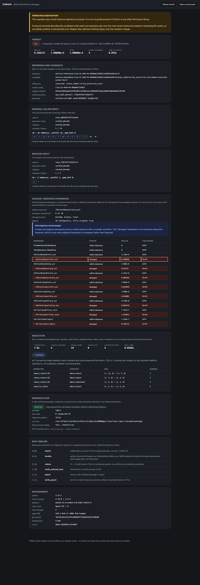

# Demo visual evidence and recording steps

## Status: browser screenshot complete; terminal video optional

[`assets/viewer-demo.png`](assets/viewer-demo.png) is a 1440×4200 full-page browser screenshot
of a real completed run, `demo-20260912-014607`, generated by:

```bash
.venv/bin/evallens demo --out artifacts/demo-visual --config configs/cpu.toml
.venv/bin/evallens view artifacts/demo-visual --host 127.0.0.1 --port 8765 --no-browser
```

The page was inspected in the in-app browser at its normal desktop viewport and at 390×844.
The actual `record.json` was then selected through the page's file picker and the reduced case
`case_7287c8c752e22ccf` remained visible. The browser console reported no warnings or errors.
The screenshot was captured from that locally served record with the already-installed Chrome;
none of its values were staged, retouched, or replaced with sample data.



The evidence also includes:

- [`demo-transcript.txt`](demo-transcript.txt) — verbatim captured stdout of `evallens doctor`
  and `evallens demo`, unedited.
- `tests/integration/test_viewer_render.py` — executes the actual `viewer/viewer.js` over an
  actual `record.json` under a strict DOM shim.
- `tests/integration/test_docs_integrity.py` — checks the committed PNG signature and its
  1440×4200 IHDR dimensions, so a missing or placeholder file cannot satisfy the gate.

## What remains unverified

No terminal video or GIF has been recorded, and the browser check covered dark mode rather than
both color schemes. The screenshot satisfies the project's screenshot/GIF/video acceptance item;
the commands below remain useful if motion capture is wanted later.

## Steps to record it

These commands are each individually tested; the optional recording-tool invocations are not,
because those tools are not installed here.

### Terminal capture

```bash
brew install asciinema          # or: pipx install asciinema
cd /path/to/evallens
asciinema rec docs/demo.cast --command "bash -c '
  evallens doctor
  evallens demo --out artifacts/demo
'"
# optional GIF conversion
npx --yes svg-term-cli --cast docs/demo.cast --out docs/demo.svg --window
```

`vhs` is a good alternative if a deterministic, scripted recording is wanted:

```bash
brew install vhs
vhs docs/demo.tape        # tape file not written; see the vhs docs for its syntax
```

### Viewer capture

```bash
evallens demo --out artifacts/demo          # writes artifacts/demo/record.json
evallens view artifacts/demo --host 127.0.0.1
# then open http://127.0.0.1:8777 and capture the window
```

On macOS, `Cmd-Shift-5` records a region or window to `.mov`; convert with
`ffmpeg -i in.mov -vf "fps=12,scale=1200:-1:flags=lanczos" -loop 0 docs/viewer.gif`.

### What the recording should show

1. `evallens doctor` — the environment and the fixture-vs-oracle self-test passing.
2. `evallens demo` — the six steps, with the injected-fault banner visible.
3. The viewer, scrolled through: the injected-fault banner, verdict, original versus reduced
   input, the earliest observed divergence table including a reconvergence, the reduction
   timeline, and the verified reproduction.
4. `python artifacts/demo/repro/repro.py --expect-mismatch` exiting 0 from a fresh shell.

## Rules for whoever records it

- Record an **actual** run. Do not stage, retouch, or re-time the output.
- The injected-fault banner must stay in frame. The fault in the demo is one this project wrote;
  a recording that crops that out misrepresents the result.
- If a step fails during recording, publish the failure or fix the bug. Do not re-roll seeds
  until the output looks good.
